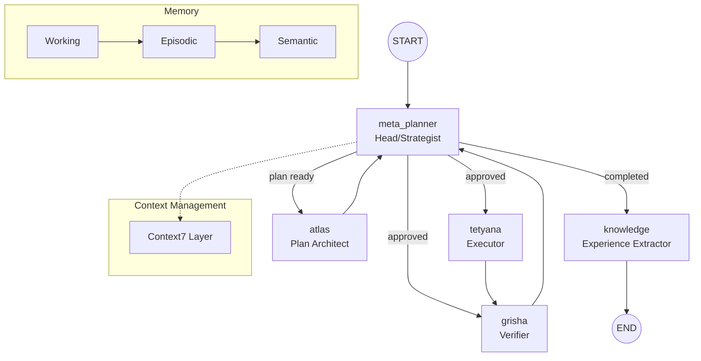

# Project Atlas Workflow Guide
**Pure Native Architecture | Trinity 2.5 | January 2026**

The single source of truth for the fundamental principles of the Atlas system (Trinity Runtime).

> [!NOTE]
> **January 2026**: Trinity Runtime reorganized into modular package `core/trinity/`. `tui/cli.py` split into modules (`scanning`, `monitoring`, `agents`).
> See [Quick Start](./QUICKSTART.md) for quick start.

---

## 1. Core Principles

Atlas — **autonomous multi-agent macOS operator**, guided by these principles:

1. **Autonomous Navigation** — Independent decisions in uncertainty. Cycle: Perception → Planning → Action → Verification.

2. **Meta-Planning 2.0** — Agent manages strategy: verification level, recovery mode, plan type. Pydantic config validation.

3. **Vision-First** — Screenshots & Computer Vision as Ground Truth. Multi-monitor & differential analysis support.

4. **Privacy & Stealth** — Trace cleanup & identifier spoofing.

5. **Continuous Learning 2.0** — Extracts success/failure experience, stores in Knowledge Base with confidence scores.

6. **State Logging & Resilience** — Detailed agent logs (`logs/trinity_state_*.log`) & LLM request recovery (Retries/Timeouts).

---

## 2. Trinity Runtime Architecture (LangGraph)

Cyclic graph-based core. Every successful mission includes learning.



### Trinity Agents & Layers

| Agent       | Role          | Description                                      |
|:------------|:--------------|:-------------------------------------------------|
| **Meta-Planner** | Orchestrator | Main orchestrator. Active Retrieval & memory filtering |
| **Context7**     | Context Manager | Token budget, sliding window prioritizing recent steps |
| **Atlas**        | Architect    | Tactical plan from normalized context            |
| **Tetyana**      | Executor     | Executes (Native/GUI/Playwright)                 |
| **Grisha**       | Verifier     | Verifies with `enhanced_vision_analysis`. Requires evidence from Tetyana |
| **Knowledge**    | Learner      | Reflection: stores experience & updates KB       |

---

## 3. Core Components

### 3.1 Trinity Runtime Package (`core/trinity/`)

```
core/trinity/
├── __init__.py
├── state.py
├── nodes/ (base.py, meta_planner.py, atlas.py, tetyana.py, grisha.py)
├── planning/
└── integration/
```

Recommended imports:
```python
from core.trinity import TrinityRuntime, TrinityPermissions
from core.trinity.state import create_initial_state
```

### 3.2 Hierarchical Memory (`core/memory.py`)

| Layer            | Duration          | Purpose                          |
|:-----------------|:------------------|:---------------------------------|
| Working         | Current session   | Temporary data, active context   |
| Episodic        | Multiple sessions | Specific events                  |
| Semantic        | Permanent         | Consolidated knowledge           |

### 3.3 Context7 (`core/context7.py`)
Dynamic token budget, priority weighting for recent/critical info, usage metrics.

### 3.4 Parallel Tool Executor (`core/parallel_executor.py`)
Parallel execution for RAG and batch operations.

### 3.5 MCP Prompt Engine (`mcp_integration/prompt_engine.py`)
ChromaDB-based: recursive ingestion, active retrieval of best practices, auto-injection into agent context.

---

## 4. Vision Pipeline

### 4.1 DifferentialVisionAnalyzer (`system_ai/tools/vision.py`)
- Multi-monitor capture
- Differential analysis + OCR
- Diff image generation

### 4.2 VisionContextManager (`core/vision_context.py`)
Trend detection, hot zone tracking, frame history (up to 10), step verification diffs.

```python
result = EnhancedVisionTools.capture_and_analyze(multi_monitor=True, generate_diff_image=True)
context_manager.update_context(result)
```

---

## 5. Meta-Planning 2.0

| Parameter         | Values                          | Description                              |
|:------------------|:--------------------------------|:-----------------------------------------|
| Strategy         | linear, rag_heavy, aggressive  | Plan type                                |
| Active Retrieval | retrieval_query                | Optimized query                          |
| Anti-patterns    | status: failed                 | Avoid failed strategies                  |
| Fail Escalation  | fail_count >= 4                | Auto-replan on repeated failures         |
| Confidence Score | 0.1...1.0                      | Reliability from edits                   |
| Source Tracking  | trinity_runtime, user          | Knowledge origin                         |

---

## 6. MCP Tools

**Internal:** Unified automation (Shell/AppleScript/Shortcuts/Mouse), cleanup/spoofing, recorder control, vision tools.

**External Servers:** Playwright (browser), PyAutoGUI, AppleScript, Anthropic (generation), Context7 (docs), SonarQube (analysis).

**Architecture:** Native SDK client only, dynamic discovery, unified routing, meta-task execution for high-level commands.

---

## 7. TUI & Themes (16 total)

Categories: Classic (monaco, dracula, nord, gruvbox), Modern (catppuccin, tokyo-night, one-dark, rose-pine), Vibrant (cyberpunk, aurora, midnight-blue, solarized-dark, vibrant, cyberpunk-neon), Special (hacker-vibe).

Switch: Ctrl+T or Settings → Appearance (with preview).

---

## 8. Improvements (Dec 2025)

- Pydantic validation with full schema checks
- MyPy type checking
- Detailed state logs
- 100% coverage unit tests (16 for models)

---

## 9. Quick Start

```bash
./setup.sh        # Dependencies
./cli.sh          # TUI
/trinity <task>   # Run
/autopilot <task> # Autonomy

# Quality
pytest tests/test_trinity_models.py -v
mypy core/
```

---

## 10. Structure & Logs

Codemap auto-generated, 163+ folders/256+ files.

Key dirs: core/trinity, core/agents, mcp_integration, system_ai/tools, tui, tests, archive.

Logs: trinity_state_*.log, .last_response.txt, task_logs, Windsurf logs.

Commands: ./regenerate_structure.sh, cat .last_response.txt, tail -f logs/trinity_state_*.log

---

## 11. Editor Integration & Logging

Windsurf/VS Code log paths provided. State logger for initial states.

---

## 12. Advanced Features

**Self-Healing:** Detection → Correction → Strategy shift → Loop limits.

**Dev Mode:** Code editing, shell exec, unsafe tools (confirmed).

**Interactivity:** TUI input, [VOICE] output, pause feedback.

---

## 13. Documentation

Main: docs/atlas.md and project_structure_final.txt