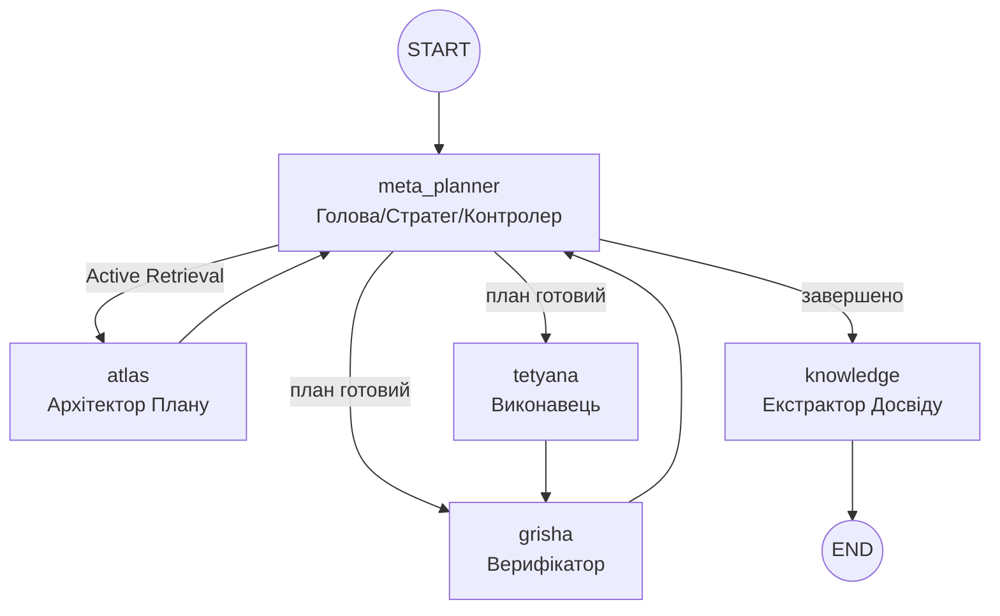

# Project Atlas: Архітектура, Workflow та Основні Принципи  
**Актуальний стан на грудень 2025 року (Cognitive 2.0)**

Цей документ є **єдиним джерелом правди** про фундаментальні принципи роботи системи Atlas (Trinity Runtime).

---

## 1. Основні принципи роботи (Core Principles)

Atlas — це не просто автоматизатор, а **автономний мультиагентний оператор macOS**, що керується наступними принципами:

1.  **Автономна Навігація (Autonomous Navigation)**  
    Здатність самостійно приймати рішення в умовах невизначеності, використовуючи цикл "Сприйняття → Планування → Дія → Верифікація".
2.  **Управління Мисленням (Meta-Planning)**  
    Агент не просто виконує кроки, він керує власною стратегією: обирає рівень верифікації, режим відновлення та тип плану.
3.  **Візуальне Сприйняття (Vision-First)**  
    Використання скріншотів та Computer Vision як основного джерела істини (Ground Truth).
4.  **Конфіденційність та Стелс-режим (Privacy & Stealth)**  
    Система очищення слідів та підміна ідентифікаторів (`spoofing`).
5.  **Постійне Навчання (Continuous Learning)**  
    Після успіху система витягує досвід та зберігає його у **Knowledge Base** з оцінкою впевненості (**Confidence Score**).

---

## 2. Архітектура Trinity Runtime (LangGraph)

Центральна нервова система Atlas базується на циклічному графі:



### 2.1 Trinity Agents

-   **Meta-Planner** (`_meta_planner_node`): Встановлює **Execution Policy**. Виконує **Active Retrieval** (генерує `retrieval_query`).
-   **Atlas** (`_atlas_node`): Перетворює політику на кроки. Виконує **Self-Review** плану.
-   **Tetyana** (`_tetyana_node`): Виконує команди (Native/GUI).
-   **Grisha** (`_grisha_node`): Верифікатор результатів.
-   **Knowledge** (`_knowledge_node`): Аналізує ефективність виконання та зберігає досвід із розрахунком **Confidence** (0.0 - 1.0).

---

## 3. Мета-планінг (Meta-planning 2.0)

| Параметр конфігу | Значення | Опис |
| :--- | :--- | :--- |
| **Strategy** | `linear`, `rag_heavy`, `aggressive` | Тип побудови плану. |
| **Retrieval Query** | Текстовий запит | **Active Retrieval**: Оптимізований запит для векторної пам'яті. |
| **Memory Depth** | `1` ... `5` | Кількість фрагментів досвіду для вилучення (`n_results`). |
| **Verification Rigor** | `low`, `medium`, `high` | Строгість перевірок Grisha. |
| **Confidence Filter** | `> 0.4` | Система ігнорує спогади з низьким рівнем успішності. |
| **Reasoning** | Обґрунтування | Чому обрано саме таку стратегію. |

---

## 4. MCP Фондація (Інструменти)

-   **Playwright MCP**: Контроль браузера.
-   **PyAutoGUI MCP**: Емуляція миші/клавіатура.
-   **Native macOS MCP**: Shell, AppleScript, File System.

---

## 5. Додаткові можливості та Інтеграції (Extensions)

### 5.1 AI-IDE Integrations
-   **Windsurf**, **Antigravity**, **Cursor**: Спеціальні профілі для розробки.

### 5.2 Cleanup & Privacy System
-   Очищення `IndexedDB`, `keychain`.
-   **Spoofing**: MAC, hostname (з авто-ревертом).

---

## 6. Система моніторингу та Трейси (Monitoring)

| Event | Опис |
| :--- | :--- |
| `trinity_run_start` | Початок графа. |
| `knowledge_stored` | Подія збереження нового досвіду та його `confidence`. |
| `atlas_plan_generated` | Створення нового плану. |
| `grisha_decision` | Вердикт (success/failed/uncertain). |

---

## 7. Швидкий старт

```bash
./cli.sh                    # Запуск TUI
/trinity <завдання>         # Trinity з Meta-Planner
/autopilot <завдання>       # Режим повної автономії
```

---

*Останнє оновлення: 19 грудня 2025*